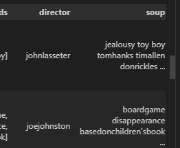
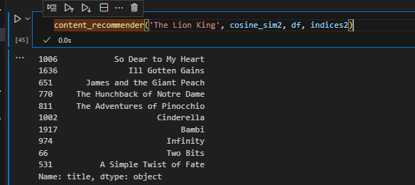
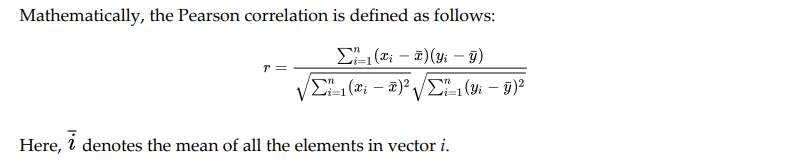
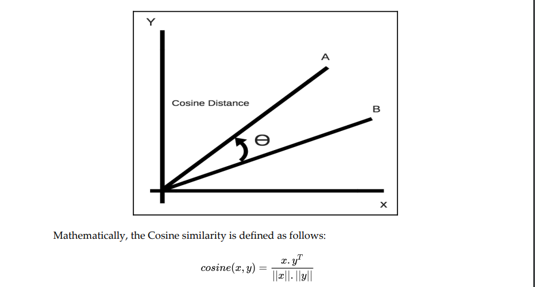
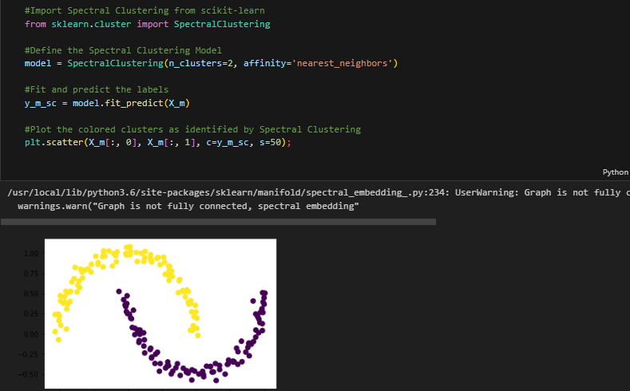
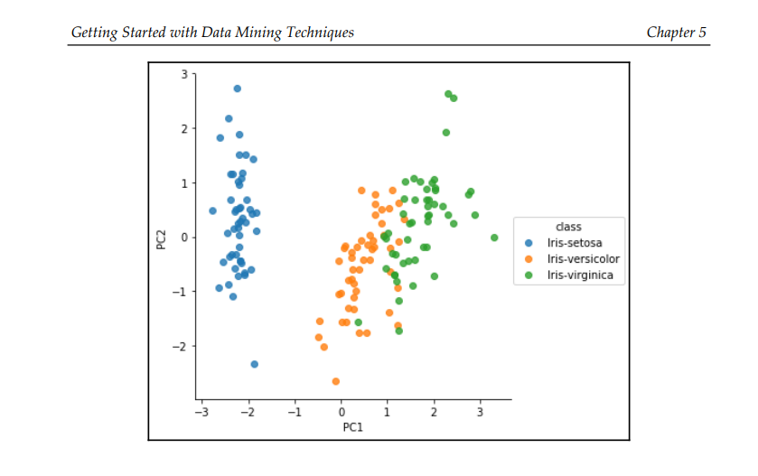

# Hands On Machine Learning Book Reading Reading Report


Here are some highlights of the different notebooks and ideas drawn from the Book That Can be used for building a recommendation system.

**Datasets**

https://www.kaggle.com/datasets/rounakbanik/the-movies-dataset/data


**Backlog**

- [x] Chapter 1
- [x] Chapter 3a: Simple Recommender System
- [x] Chapter 3b: Knowledge-Based Recommender System
- [ ] Chapter 4: Content-Based Recommender System
- [ ] Chapter 5: Getting Started with Data mining Techniques
  - [ ] Similarity Measures
  - [ ] Clustering
  - [ ] Dimensionality Reduction
  - [ ] Evaluation Metrics
- [ ] Chapter 6: Building Collaborative Filtering Recommender System
  - [ ] User-Based Collaborative Filtering
  - [ ] Item-Based Collaborative Filtering
  - [ ] Model-Based Collaborative Filtering
  

## Chapter 3: Simple Recommender System

It uses a weighted rating system to calculate the score:

```py
# Function to compute the IMDB weighted rating for each movie
def weighted_rating(x, m=m, C=C):
    v = x['vote_count']
    R = x['vote_average']
    # Compute the weighted score
    return (v/(v+m) * R) + (m/(m+v) * C)
```

## Chapter 3: Knowledge-Based Recommender System 

> Seems to be exloring basic filtering then rating based on the `vote counts` and `vote average` of the movies. to give the recommendations

```py
def build_chart(gen_df, percentile=0.8):
    #Ask for preferred genres
    print("Input preferred genre")
    genre = input()
    
    #Ask for lower limit of duration
    print("Input shortest duration")
    low_time = int(input())
    
    #Ask for upper limit of duration
    print("Input longest duration")
    high_time = int(input())
    
    #Ask for lower limit of timeline
    print("Input earliest year")
    low_year = int(input())
    
    #Ask for upper limit of timeline
    print("Input latest year")
    high_year = int(input())
    
    #Define a new movies variable to store the preferred movies. Copy the contents of gen_df to movies
    movies = gen_df.copy()
    
    #Filter based on the condition
    movies = movies[(movies['genre'] == genre) & 
                    (movies['runtime'] >= low_time) & 
                    (movies['runtime'] <= high_time) & 
                    (movies['year'] >= low_year) & 
                    (movies['year'] <= high_year)]
    
    #Compute the values of C and m for the filtered movies
    C = movies['vote_average'].mean()
    m = movies['vote_count'].quantile(percentile)
    
    #Only consider movies that have higher than m votes. Save this in a new dataframe q_movies
    q_movies = movies.copy().loc[movies['vote_count'] >= m]
    
    #Calculate score using the IMDB formula
    q_movies['score'] = q_movies.apply(lambda x: (x['vote_count']/(x['vote_count']+m) * x['vote_average']) 
                                       + (m/(m+x['vote_count']) * C)
                                       ,axis=1)

    #Sort movies in descending order of their scores
    q_movies = q_movies.sort_values('score', ascending=False)
    
    return q_movies
```


## Chapter 4: Content-Based Recommender System

**TF IDFV Vectorizer**


**Cosine Similarity**


**You can see here how depending on the content entered: Provides Similar like content**


Process:

- 1. We extract and populate the director using:

```py
# Extract the director's name. If director is not listed, return NaN
def get_director(x):
    for crew_member in x:
        if crew_member['job'] == 'Director':
            return crew_member['name']
    return np.nan
```

- 2. Fielter for lists that have more than 3 elements.

```py

# Returns the list top 3 elements or entire list; whichever is more.
def generate_list(x):
    if isinstance(x, list):
        names = [i['name'] for i in x]
        #Check if more than 3 elements exist. If yes, return only first three. If no, return entire list.
        if len(names) > 3:
            names = names[:3]
        return names

    #Return empty list in case of missing/malformed data
    return []
```

> Here where the casts applies.

```py
#Apply the generate_list function to cast and keywords
df['cast'] = df['cast'].apply(generate_list)
df['keywords'] = df['keywords'].apply(generate_list)
```

Sanitation of the ists and makesure they are lowercase


```py
# Function to sanitize data to prevent ambiguity. It removes spaces and converts to lowercase
def sanitize(x):
    if isinstance(x, list):
        #Strip spaces and convert to lowercase
        return [str.lower(i.replace(" ", "")) for i in x]
    else:
        #Check if director exists. If not, return empty string
        if isinstance(x, str):
            return str.lower(x.replace(" ", ""))
        else:
            return ''
```


```py
#Function that creates a soup out of the desired metadata
def create_soup(x):
    return ' '.join(x['keywords']) + ' ' + ' '.join(x['cast']) + ' ' + x['director'] + ' ' + ' '.join(x['genres'])
```

- 3. Create a `soup`




- 4. Soups

```py
# Import CountVectorizer
from sklearn.feature_extraction.text import CountVectorizer

#Define a new CountVectorizer object and create vectors for the soup
count = CountVectorizer(stop_words='english')
count_matrix = count.fit_transform(df['soup'])

#Import cosine_similarity function
from sklearn.metrics.pairwise import cosine_similarity

#Compute the cosine similarity score (equivalent to dot product for tf-idf vectors)
cosine_sim2 = cosine_similarity(count_matrix, count_matrix)
```

> Here uses the soup of director, casts and genres for the recommendation

```py
# Function that takes in movie title as input and gives recommendations 
def content_recommender(title, cosine_sim, df, indices):
    # Obtain the index of the movie that matches the title
    idx = indices[title]

    # Get the pairwsie similarity scores of all movies with that movie
    # And convert it into a list of tuples as described above
    sim_scores = list(enumerate(cosine_sim[idx]))

    # Sort the movies based on the cosine similarity scores
    sim_scores = sorted(sim_scores, key=lambda x: x[1], reverse=True)

    # Get the scores of the 10 most similar movies. Ignore the first movie.
    sim_scores = sim_scores[1:11]

    # Get the movie indices
    movie_indices = [i[0] for i in sim_scores]

    # Return the top 10 most similar movies
    return df['title'].iloc[movie_indices]
```

> Use the following content recommender.

You can see here how it has a more content-based recommendation.


```py
content_recommender('The Lion King', cosine_sim2, df, indices2)
```




- **Experiment with the number of keywords, genres, and cast**: In the model that we built, we considered at most three keywords, genres, and actors for our movies. This was, however, an arbitrary decision. It is a good idea to experiment with the number of these features in order to be considered for the metadata
soup.
- **Come up with more well-defined sub-genres**: Our model only considered the first three keywords that appeared in the keywords list. There was, however, no justification for doing so. In fact, it is entirely possible that certain keywords appeared in only one movie (thus rendering them useless). A much more potent technique would be to define, as with the genres, a definite number of sub-genres and assign only these sub-genres to the movies.

> In mo some categories are so large that makes sense to break them down

- **Give more weight to the director**: Our model gave as much importance to the director as to the actors. However, you can argue that the character of a movie is determined more by the former. We can give more emphasis to the director by mentioning this individual multiple times in our soup instead of just once. Experiment with the number of repetitions of the director in the soup. Consider other members of the crew: The director isn't the only person that gives the movie its character. You can also consider adding other crew members, such as producers and screenwriters, to your soup.
- **Experiment with other metadata**: We only considered genres, keywords, and credits while building our metadata model. However, our dataset contains plenty of other features, such as production companies, countries, and languages. You may consider these data points, too, as they may be able to capture important information (such as if two movies are produced by Pixar).
- **Introduce a popularity filter**: It is entirely possible that two movies have the same genres and sub-genres, but differ wildly in quality and popularity. In such cases, you may want to introduce a popularity filter that considers the n most similar movies, computes a weighted rating, and displays the top five results.
You have already learned how to do this in the previous chapter.

## Chapter 5. Getting Started with Data Mining Techniques


> Make this conversion first as for (2024)

```py
from sklearn.datasets import make_blobs
```
- **Similarity measures**: Given two items, how do we mathematically quantify how different or similar they are to each other? Similarity measures help us in answering this question. We have already made use of a similarity measure (the cosine score) while building our content recommendation engine. In this chapter, we will be looking at a few other popular similarity scores.


**Euclidina Distance**


> Euclidian Distances using vectors.


**Peason Distance**



> Here is a better way to calculate similarity as it considers the biases people may have on their data.
> For this we have 


**Cosine Similarity**



> You can see how the cosine similarity is when we want to find how the vectors differ (in maginutde)


- **Dimensionality reduction**: When building collaborative filters, we are usually dealing with millions of users rating millions of items. In such cases, our user and item vectors are going to be of a dimension in the order of millions. To improve performance, speed up calculations, and avoid the curse of dimensionality, it is often a good idea to reduce the number of dimensions considerably, while retaining most of the information. This section of the chapter will describe techniques that do just that.


- **Supervised learning**: Supervised learning is a class of machine learning algorithm that makes use of label data to infer a mapping function that can then be used to predict the label (or class) of unlabeled data. We will be looking at some of the most popular supervised learning algorithms, such as support vector machines, logistic regression, decision trees, and ensembling.


- **Clustering**: Clustering is a type of unsupervised learning where the algorithm tries to divide all the data points into a certain number of clusters. Therefore, without the use of a label dataset, the clustering algorithm is able to assign classes to all the unlabel points. In this section, we will be looking at k-means
clustering, a simple but powerful algorithm popularly used in collaborative filters.


- Choosing the amount of K is key.


> Here you can see that after the thrid iterations there is no much change in the Sum of Squared Values.


- **Evaluation methods and metrics**: We will take a look at a few evaluation metrics that are used to gauge the performance of these algorithms. The metrics includeaccuracy, precision, and recall.

- nearest_neighbors




- **Feature selection**: This method involves identifying the features that have the least predictive power and dropping them altogether. Therefore, feature selection involves identifying a subset of features that is most important for that particular use case. An important distinction of feature selection is that it maintains the original meaning of every retained feature. For example, let's say we have a housing dataset with price, area, and number of rooms as features. Now, if we were to drop the area feature, the remaining price and number of rooms features
will still mean what they did originally.

- **Feature extraction**: Feature extraction takes in m-dimensional data and transforms it into an n-dimensional output space (usually where m >> n), while retaining most of the information. However, in doing so, it creates new features that have no inherent meaning. For example, if we took the same housing dataset and used feature extraction to output it into a 2D space, the new features won't mean price, area, or number of rooms. They will be devoid of any meaning.


**Principal Component Analysis**


For this we need to transfor our dataframe:

- Convert into 1, -1 range




### Singular Value Decomposition


#### **Supervised Learning**
- Classification
- Regression


#### K Nearest Neighbors


- Lazy in nature
- hat k-NN does not make any underlying assumptions about the distribution of the data
-  This also means that the k-NN model needs to have access to the training data at all times and cannot discard it during prediction like its sister algorithms.
- Usually Odd K's

#### Ensemblling

- Multiple Algorithms is much better than a single one.

**Bagging and Random Forests**

![[../img/Pasted image 20240326170738.png]]

- Selected using the square root of total number of features
- Percentage Sampling
- Baseline Treelike classification
- Until N number of models are trained.
- Doesn't learn mistakes from other models.

#### Boosting


![[../img/Pasted image 20240326171122.png]]

> Here can be seen how Gradient Boosting is used to gauge the predictive power of each. . Achieving 97%


### Evaluation Metrics


# Here the evaluation metrics:

  
![[../img/Pasted image 20240327152944.png]]


### 6. Collaborative Filtering


```py
#Function to compute the RMSE score obtained on the testing set by a model
def score(cf_model):
    
    #Construct a list of user-movie tuples from the testing dataset
    id_pairs = zip(X_test['user_id'], X_test['movie_id'])
    
    #Predict the rating for every user-movie tuple
    y_pred = np.array([cf_model(user, movie) for (user, movie) in id_pairs])
    
    #Extract the actual ratings given by the users in the test data
    y_true = np.array(X_test['rating'])
    
    #Return the final RMSE score
    return rmse(y_true, y_pred)
```

```py
score(baseline)
```

```
1.2488234462885457
```

Can RMSE be greater than 1?
RMSE could be more that 1. that's just mean that your model couldn't find a solution or (optimized very well). It means that the squared root of squared differences between your predictions and observed values is 11. Naturally lower values indicate a better fit of your model.May 31, 2020

https://stackoverflow.com/questions/62122206/what-does-it-mean-if-an-rmse-has-a-value-far-beyond-1#:~:text=RMSE%20could%20be%20more%20that,or%20(optimized%20very%20well).&text=It%20means%20that%20the%20squared,better%20fit%20of%20your%20model.


#### Mean

- Just replace the meaan function by the mean if needed


```py
#User Based Collaborative Filter using Mean Ratings
def cf_user_mean(user_id, movie_id):
    
    #Check if movie_id exists in r_matrix
    if movie_id in r_matrix:
        #Compute the mean of all the ratings given to the movie
        mean_rating = r_matrix[movie_id].mean()
    
    else:
        #Default to a rating of 3.0 in the absence of any information
        mean_rating = 3.0
    
    return mean_rating
```

Score rating:


```
1.0300824802393536
```


#### Weighted Mean

```py
#User Based Collaborative Filter using Weighted Mean Ratings
def cf_user_wmean(user_id, movie_id):
    
    #Check if movie_id exists in r_matrix
    if movie_id in r_matrix:
        try:
            #Get the similarity scores for the user in question with every other user
            sim_scores = cosine_sim[user_id]
            
            #Get the user ratings for the movie in question
            m_ratings = r_matrix[movie_id]
            
            #Extract the indices containing NaN in the m_ratings series
            idx = m_ratings[m_ratings.isnull()].index
            
            #Drop the NaN values from the m_ratings Series
            m_ratings = m_ratings.dropna()
            
            #Drop the corresponding cosine scores from the sim_scores series
            sim_scores = sim_scores.drop(idx)
            
            #Compute the final weighted mean
            wmean_rating = np.dot(sim_scores, m_ratings)/ sim_scores.sum()
        except:
            #Default to a rating of 3.0 in the absence of any information
            wmean_rating = 3.0
    
    else:
        #Default to a rating of 3.0 in the absence of any information
        wmean_rating = 3.0
    
    return wmean_rating
```

End score:
```
1.023663367309459
```
Not that much of an improvement I would say.


#### Demographics Filter?

```py
#Gender Based Collaborative Filter using Mean Ratings
def cf_gender(user_id, movie_id):
    
    #Check if movie_id exists in r_matrix (or training set)
    if movie_id in r_matrix:
        #Identify the gender of the user
        gender = users.loc[user_id]['sex']
        
        #Check if the gender has rated the movie
        if gender in gender_mean[movie_id]:
            
            #Compute the mean rating given by that gender to the movie
            gender_rating = gender_mean[movie_id][gender]
        
        else:
            gender_rating = 3.0
    
    else:
        #Default to a rating of 3.0 in the absence of any information
        gender_rating = 3.0
    
    return gender_rating
```

> 1.0392906999935203

**Ocupation Based**

```py
#Gender and Occupation Based Collaborative Filter using Mean Ratings
def cf_gen_occ(user_id, movie_id):
    
    #Check if movie_id exists in gen_occ_mean
    if movie_id in gen_occ_mean.index:
        
        #Identify the user
        user = users.loc[user_id]
        
        #Identify the gender and occupation
        gender = user['sex']
        occ = user['occupation']
        
        #Check if the occupation has rated the movie
        if occ in gen_occ_mean.loc[movie_id]:
            
            #Check if the gender has rated the movie
            if gender in gen_occ_mean.loc[movie_id][occ]:
                
                #Extract the required rating
                rating = gen_occ_mean.loc[movie_id][occ][gender]
                
                #Default to 3.0 if the rating is null
                if np.isnan(rating):
                    rating = 3.0
                
                return rating
            
    #Return the default rating    
    return 3.0
```

> 1.1419651376788005

Way worse

```
1. Find the k-nearest neighbors of u who have rated movie m
2. Output the average rating of the k users for the movie m
```

Using **Surpise**:

```py
#Import the required classes and methods from the surprise library
from surprise import Reader, Dataset, KNNBasic
from surprise.model_selection import cross_validate

#Define a Reader object
#The Reader object helps in parsing the file or dataframe containing ratings
reader = Reader()

#Create the dataset to be used for building the filter
data = Dataset.load_from_df(ratings, reader)

#Define the algorithm object; in this case kNN
knn = KNNBasic()

#Evaluate the performance in terms of RMSE
cross_validate(knn, data, measures=['RMSE'], verbose=True)
```

```
Computing the msd similarity matrix...
Done computing similarity matrix.
Computing the msd similarity matrix...
Done computing similarity matrix.
Computing the msd similarity matrix...
Done computing similarity matrix.
Computing the msd similarity matrix...
Done computing similarity matrix.
Computing the msd similarity matrix...
Done computing similarity matrix.
Evaluating RMSE of algorithm KNNBasic on 5 split(s).

                  Fold 1  Fold 2  Fold 3  Fold 4  Fold 5  Mean    Std     
RMSE (testset)    0.9786  0.9799  0.9693  0.9851  0.9832  0.9792  0.0055  
Fit time          0.76    0.48    0.55    0.48    0.40    0.53    0.12    
Test time         3.39    3.73    3.32    3.70    3.38    3.50    0.17    
{'test_rmse': array([0.97864372, 0.97990445, 0.96929669, 0.98507706, 0.98315568]),
 'fit_time': (0.7586112022399902,
  0.4836082458496094,
  0.5462234020233154,
  0.48327016830444336,
  0.4006950855255127),
 'test_time': (3.3917348384857178,
  3.725182056427002,
  3.3193581104278564,
  3.700237989425659,
  3.380105495452881)}
```


> A mean of `0.9792` sustantial improvement.

#### SVD

```py
#Import SVD
from surprise import SVD

#Define the SVD algorithm object
svd = SVD()

#Evaluate the performance in terms of RMSE
cross_validate(svd, data, measures=['RMSE'], verbose=True)
```

```
Evaluating RMSE of algorithm SVD on 5 split(s).

                  Fold 1  Fold 2  Fold 3  Fold 4  Fold 5  Mean    Std     
RMSE (testset)    0.9352  0.9264  0.9348  0.9311  0.9505  0.9356  0.0081  
Fit time          1.48    1.00    1.24    0.98    1.16    1.17    0.18    
Test time         0.19    0.12    0.14    0.21    0.14    0.16    0.04    
{'test_rmse': array([0.93517794, 0.92644328, 0.93476948, 0.93105806, 0.95048541]),
 'fit_time': (1.4753427505493164,
  1.0038070678710938,
  1.2418856620788574,
  0.9770834445953369,
  1.1576735973358154),
 'test_time': (0.1932990550994873,
  0.11502718925476074,
  0.14063382148742676,
  0.20772171020507812,
```


> A mena of `0.9356` which is the best performance so far.

#### Slope One:

```py
#Import SVD
from surprise import SlopeOne

#Define the SVD algorithm object
slopeOne = SlopeOne()

#Evaluate the performance in terms of RMSE
cross_validate(slopeOne, data, measures=['RMSE'], verbose=True)
```


```
Evaluating RMSE of algorithm SlopeOne on 5 split(s).

                  Fold 1  Fold 2  Fold 3  Fold 4  Fold 5  Mean    Std     
RMSE (testset)    0.9381  0.9456  0.9505  0.9450  0.9442  0.9447  0.0040  
Fit time          0.50    0.51    0.60    0.69    0.81    0.62    0.12    
Test time         2.87    2.65    2.89    3.92    3.52    3.17    0.47 
```


### More Prediction Algoritms

https://surprise.readthedocs.io/en/stable/prediction_algorithms_package.html

The prediction_algorithms package includes the prediction algorithms available for recommendation. The available prediction algorithms are:

random_pred.NormalPredictor

Algorithm predicting a random rating based on the distribution of the training set, which is assumed to be normal.

baseline_only.BaselineOnly

Algorithm predicting the baseline estimate for given user and item.

knns.KNNBasic

A basic collaborative filtering algorithm.

knns.KNNWithMeans

A basic collaborative filtering algorithm, taking into account the mean ratings of each user.

knns.KNNWithZScore

A basic collaborative filtering algorithm, taking into account the z-score normalization of each user.

knns.KNNBaseline

A basic collaborative filtering algorithm taking into account a baseline rating.

matrix_factorization.SVD

The famous SVD algorithm, as popularized by Simon Funk during the Netflix Prize.

matrix_factorization.SVDpp

The SVD++ algorithm, an extension of SVD taking into account implicit ratings.

matrix_factorization.NMF

A collaborative filtering algorithm based on Non-negative Matrix Factorization.

slope_one.SlopeOne

A simple yet accurate collaborative filtering algorithm.

co_clustering.CoClustering

A collaborative filtering algorithm based on co-clustering.

#### Hybrid Recommender: Cosine Similarity Implementation

https://naomy-gomes.medium.com/the-cosine-similarity-and-its-use-in-recommendation-systems-cb2ebd811ce1

```
cosine_sim_map.csv
```


Check this repository:

https://github.com/naomyduarteg/LIA-FastAPI-SQL


