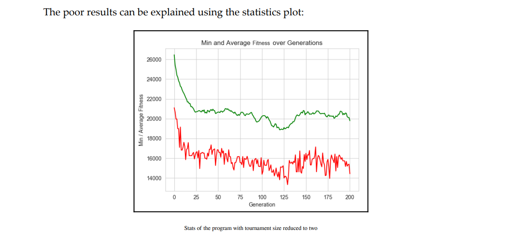

## 2. Understanding the Key Components of Genetic Algorithms

### Selection Methods

| Selection Method              | Distinction | Advantages | Illustration                                        |
| ----------------------------- | ----------- | ---------- | --------------------------------------------------- |
| Roulette Wheel Selection      |             |            |      |
| Stochastic Universal Sampling |             |            |   |
| Rank Based                    |             |            |      |
| Tournament Selection          |             |            |      |
|                               |             |            |                                                     |
|                               |             |            |                                                     |

![../img/Pasted image 20240330114326.png]

### Cross Over Methods
#### Single Point Crossover

#### Cross Over Method

#### Uniform Crossover

### Ordered Cross Over

### Mutation Methods

| Method                 | Picture                                         | Description                                                              |
| ---------------------- | ----------------------------------------------- | ------------------------------------------------------------------------ |
| Flip Bit Mutation      |  |                                                                          |
| Swap Mutation          |  | For non binary/integer based chromosomes, randomly selected gets swapped |
| Inversion mutation     |  | Sequences are reversed                                                   |
| Real Coded Algoritmics |  |                                                                          |
| Blend Crossover        |  |                                                                          |
|                        |  |                                                                          |
|                        |                                                 |                                                                          |

## 3. Using the DEAP Framework

**Code**

#### 3.1 DEAP Framework Long

Shows the long strategy using loops, and more in depth exploration of a solution
#### 3.2 DEAP Framework Short

- Literally just defines:
	- The fitness Sterategies

## 4. Combinatorial Operations

### 4.1 Permutations

#### The Rosetta Knapsack Problem

## The Traveling Salesman

