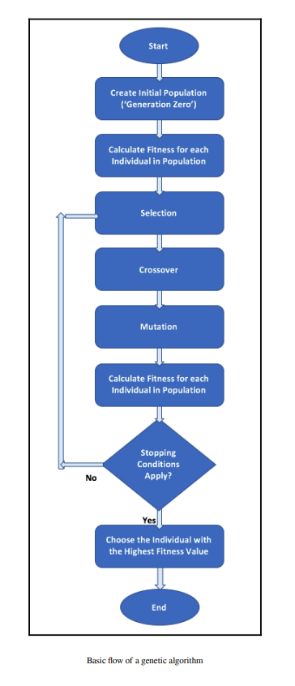
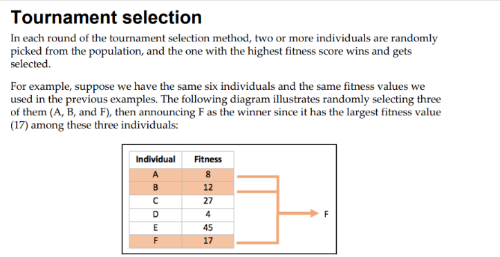
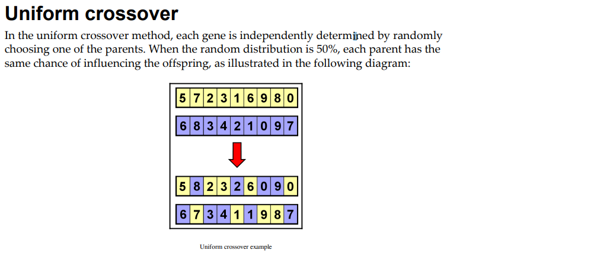
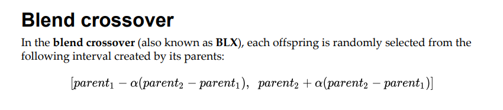
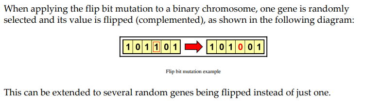
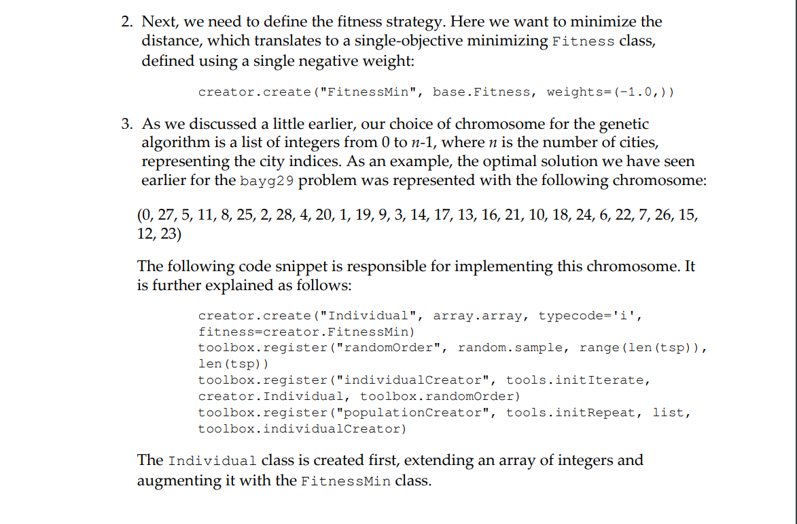
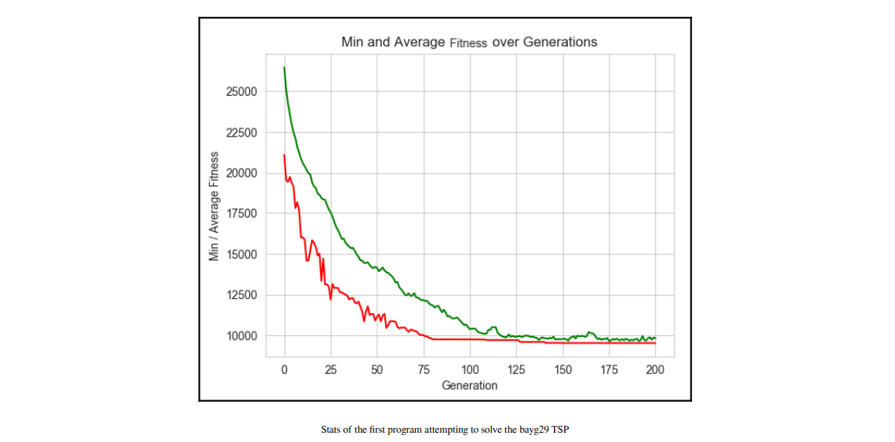
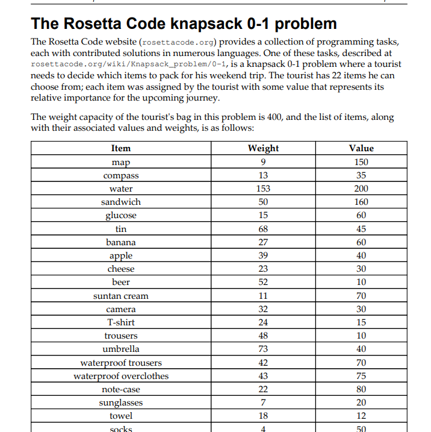
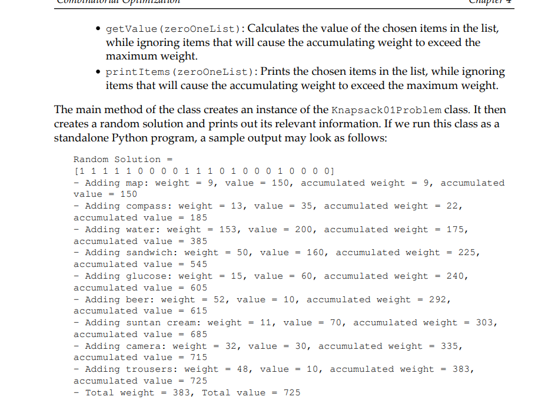
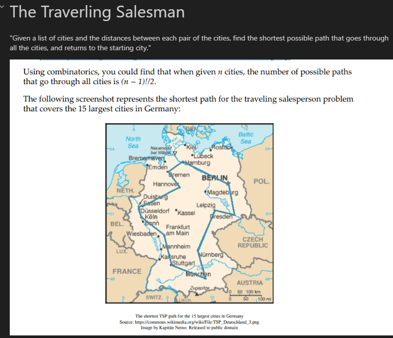

## Introduction to Genetic Algorithms


Here a small section describing distinctively what Genetic Algorithms are and how they are used in optimization problems.


###  Resources


::::{card-carousel} 2

:::{card}
:margin: 3
:class-body: text-center
:class-header: bg-light text-center
:link: https://paper.flys.dev/api/documents/429/preview/
**Hands-On Genetic Algorithms with Python**
^^^
```{image} https://gcdnb.pbrd.co/images/sCQNSiRcgwcH.png?o=1
:height: 100
```

+++
{bdg-primary}`Packt`
{bdg-primary}`Eyal Wirsansky`
+++
Explore this project {fas}`arrow-right`
:::


:::{card}
:margin: 3
:class-body: text-center
:class-header: bg-light text-center
:link: https://paper.flys.dev/api/documents/428/preview/
**An Introduction To Genetic Algorithms**
^^^
```{image} https://storage.googleapis.com/openscreenshot/V%2F5%2Fs/ksaYnDs5V.png
:height: 100
```

+++
{bdg-primary}`Mitchell Melanie`
{bdg-primary}`MIT Press`
+++
Quick Access {fas}`arrow-right`
:::

::::

## 2. Understanding the Key Components of Genetic Algorithms




### Selection Methods


| Selection Method              | Illustration                          |
| ----------------------------- | ------------------------------------- |
| Roulette Wheel Selection      |  |
| Stochastic Universal Sampling |  |
| Rank Based                    |  |
| Tournament Selection          |  |


### Cross Over Methods
#### Single Point Crossover


#### Cross Over Method


#### Uniform Crossover



### Ordered Cross Over


### Mutation Methods

| Method                 | Picture                                                 | Description                                                              |
| ---------------------- | ------------------------------------------------------- | ------------------------------------------------------------------------ |
| Flip Bit Mutation      |  |                                                                          |
| Swap Mutation          |  | For non binary/integer based chromosomes, randomly selected gets swapped |
| Inversion mutation     |  | Sequences are reversed                                                   |
| Real Coded Algoritmics |  |                                                                          |
| Blend Crossover        |  |                                                                          |


## 3. Using the DEAP Framework


**Code**

#### 3.1 DEAP Framework Long

Shows the long strategy using loops, and more in depth exploration of a solution
#### 3.2 DEAP Framework Short

- Literally just defines:
	- The fitness Sterategies



## 4. Combinatorial Operations


### 4.1 Permutations







#### The Rosetta Knapsack Problem







#### The Traveling Salesman





#### The vehicle routing problem


Imagine that you now manage a larger fulfillment center. You still need to deliver packages to a list of customers, but now you have a fleet of several vehicles at your disposal. What is the best way to deliver the packages to the customers using these vehicles?


