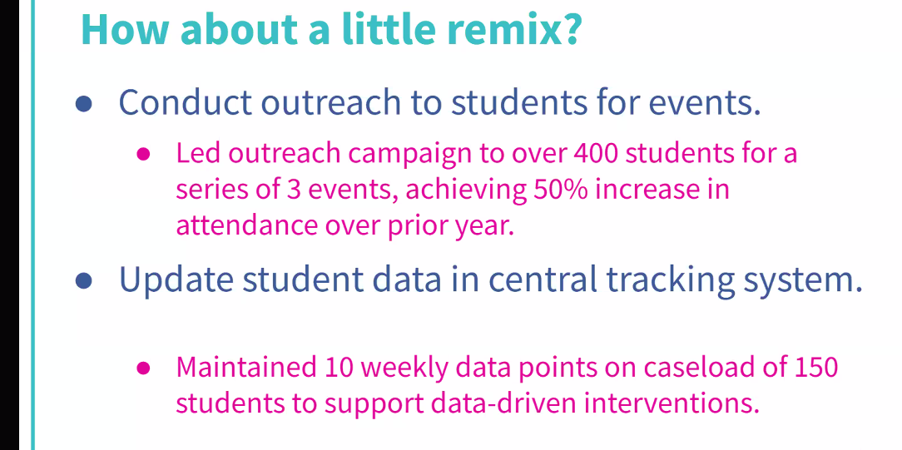
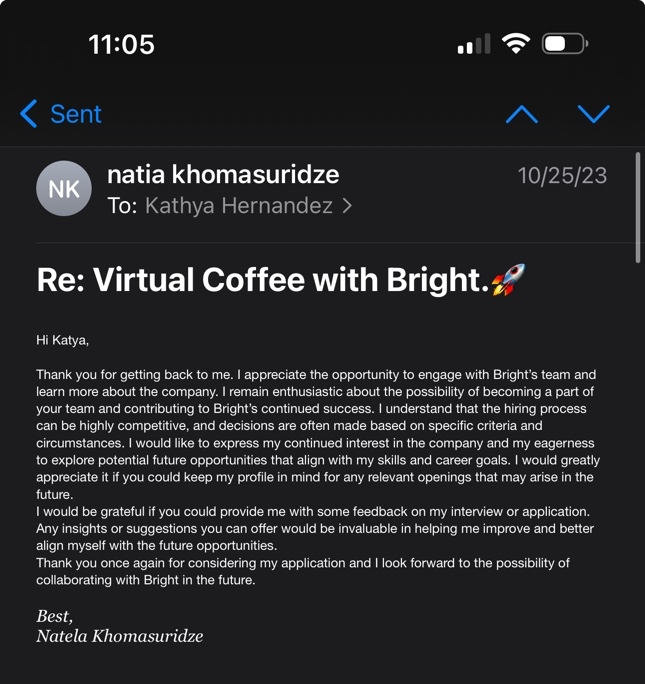
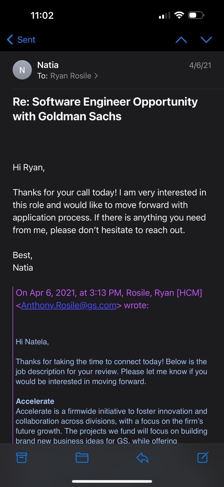
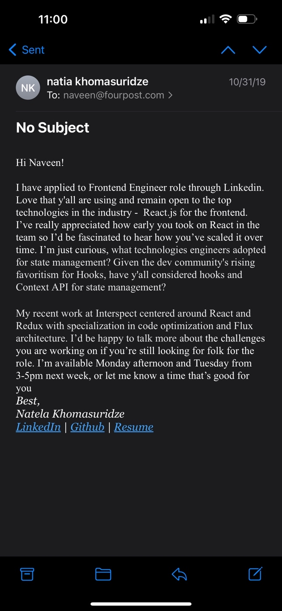
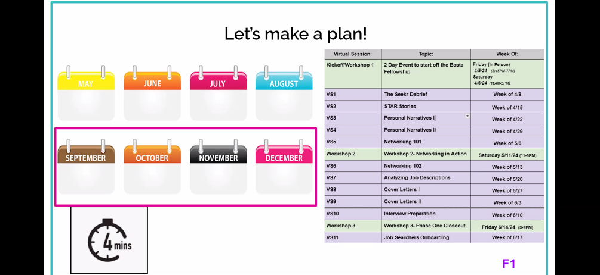

## Resume Builder

- Follow the XYZ Format
- Don't have summary Statement
- Highschool: Don't include it!
- GPA: In tech and finance. 3.0 or higher.
- Part Time: If you don't have a relevant then yes.
- Classes Taken: Only the tough ones that are also relevant to the position.

- Conduct outreach to students for events?

>  "Spearheaded the accurate and timely updating of student records within the central tracking system, ensuring data integrity with institutional policies.

Joining 5 Breakout Room

https://www.inc.com/bill-murphy-jr/google-recruiters-say-these-5-resume-tips-including-x-y-z-formula-will-improve-your-odds-of-getting-hired-at-google.html

What resonated? What didn’t?
Do you see any connections between the strengths you identified yesterday and your experience as a first-gen grad? 
How might we draw on these strengths in professional settings?

- We do have to be resilient and keep inviting yourself back. 
- Work Harder, When you don't have the same resources: Choosing to do this. balance, paying bills. 
- As first gen we come from understand new cultures. 

- How are we literally finding ways to to break into the industry when there is much.
- I think we find a lot of creative ways to be resource
- In professional settings I think as first gens we are used to rejections so we naturally have tough skin. Also exploring solutions for drawing.
- I don't know if this is a strength, but we do have or start with lower expectations of the first job, and we can understand the idea of progressively growing form that point. 

- For those who have some accent, although you might have VISA to work, I think you don't want to be integrated into it. I think one might want to hide their where one is from is also, I do try to blend in, because of the accent, I am worried that I might not be able to communicate well my ideas. 

- Nelson
- My sister is named Nancy
- I think my parents didn't think that much about the name as they didn't speak a western language that sounded good enough.

Cohort 1: https://calendly.com/alyssa-hurtado   
Cohort 2[:](https://calendly.com/diego-zecena/spring-cohort-1-1) https://calendly.com/mel-dreyer-rivera/1-1-intro-chats?back=1&month=2023-06

- I love that the breakout rooms builds the community
- Breakout rooms and owner two people. 
- We had longer breaks. breaks. 
- 

