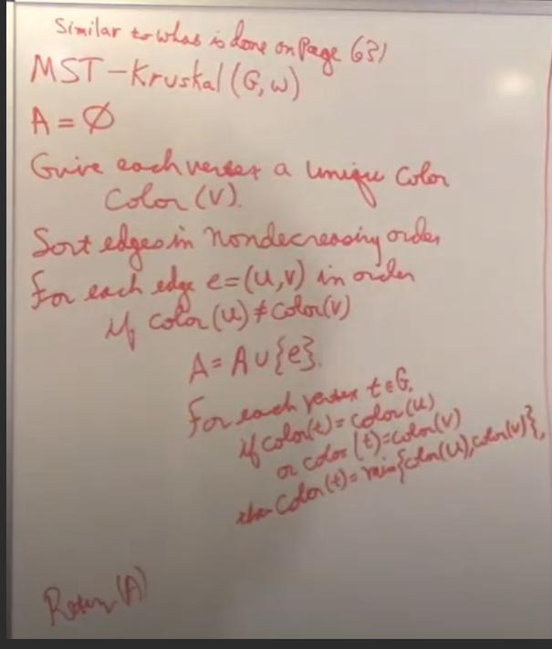
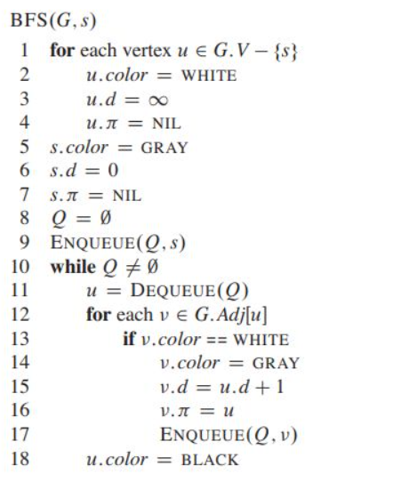
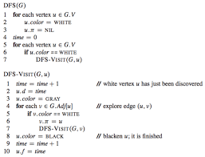

### Pseudocode

Kruskal




```py
def kruskal(graph, edges):
    A = {}
    for vert in graph:
        vert.color = random

    edges.sort(ascending)
    for edge in edges:
        u, v = edge
        if color(u) != color(v):
            A union {u, v}
            
            for vertex in graph
                if v.color == u.color or v.color == u.color:
                    v.color = min(u.color,  v.color)


```

Prims

```python
def prims(grpah, edges, s):
    for v in graph:
        v.p = None
        v.d = 0
    
    s.d = 0

    q = queue(grpah.v)
    while(len(q)):
        u = extract(q)
        for v in g.adj[u]:
            if v.d > edges(u, v) and v in q:
                v.d = edge(u, v)
                v.p = u
    

```



bfs

```py
def dfs(g, s):
    # First make d = -1 and p = none
    for v in g:
        v.d = inf
        v.p = None
        v.color = white
    
    s.d = 0
    u.color = grey
    u.p = None
    Q = queue().enqueue(v)

    while(Q.len > 0):
        u = extract(q)
        for adj in g.adj[v]:
            if adj.color == white:
                adj.d = u.d + 1
                adj.p = u
                adj.color = grey
                Q.enqueue(adj)
        u.color = BLACK

```


dfs



```py
def dfs(g, s):
    for v in g:
        v.p = None
        v.t = inf
        v.color = white
    
    time = 0
    for v in g:
        if v.color == white:
            dfsvisit(v, g)

def dfsvisit(v, g):
    time += 1
    v.t = time
    v.color = GREY

    for u in g.adj(u):
        if u.color > 0:
            if u.color == WHITE:
                u.p = v
                dfsvisit(u, g)
    
    v.color = BLACK
    time += 1
    v.f = time


```


### FInal

- We will have some of this small probelms and try to solve them manually.
- Exam is 21st
- Is going to start 5-8: You will have till alter
- Chapters:
  - 4, 7, 12, 15, 22, my complexity chapter (5)
    - 3 questions of the complexity | And 5 other questions of each. 
  - 8 questions each is 5 points. worth 35%


