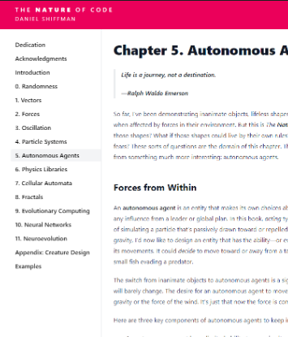
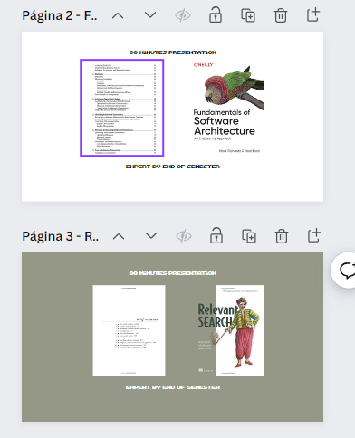

## 1. Introduction

### Idea

- To be used as a draft for publishing together with Video Notes becoming a finish product.
- Inspiration: 

| Book                                                                                   | Screenshot                         |
| -------------------------------------------------------------------------------------- | ---------------------------------- |
| [Nature of Code](https://natureofcode.com/)                                            |  |
| [Backlog Cnavas](https://www.canva.com/design/DAF5xlnHeIg/XQEhkWzBMrvRMLsLVbXBUw/edit) |  |


Searching for a Backlog?

### What this is

*The intention of the book is to be used to annotate as a draft for publishing together with Video Notes becoming a finish product.*

Areas of Foucs

- Algorithms Implementations (custom assigments)
- Data Science Implementations of Assigments 
- Data Engineering
- Best Practices
- System Design

*In a draft to be just loose notes regarding*

- Collection of:
  - Assgiments
  - Personal Assigments
  - Projects


The expected format for my notes are:

- Personal Tasks
- Code experimenting with Something.
- Solutions to Coding Problems
  - NOTE: The journey of it is to be done in `Logseq`.


### What this is NOT

- Marked Handbooks
- Makes no sense to have insights without doing the practical work from it. 
- Every Ipynb Expected to be developed by the author.
- Annotation of Books, Summaries, or any other content. That is to be done on logseq. (Better for handling pictures and connected notes.)
- Might reference third party notebooks, but will not be included here.
- Copied Handnotes might be available in the codebase. BUT NOT in `toc.yml` for quick reference
- If I dont understand it (because I didnt do the assigment) I will not include it in the book. It is not supposed to be a 1 to 1 Cookbook or Documentation reference.


### Setup


```
python -m venv venv
venv\Scripts\activate
pip install -r requirements.txt
```


